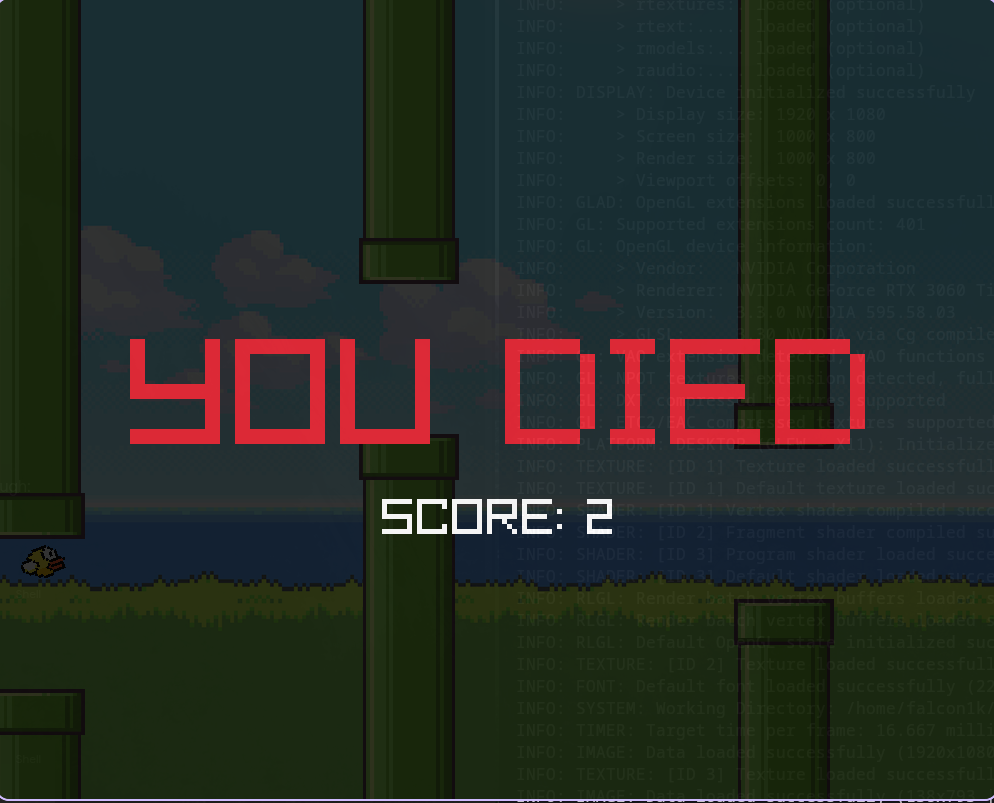

# Flop A Bird

A remake of the classic _Flappy Bird_, written in C++ using [RayLib](https://www.raylib.com/) for graphics rendering.




## Prerequisites

Before you can build the game, you'll need to have the following installed:

- **CMake** - [Installation guide](https://cmake.org/install/)
- **RayLib** - [Installation guide](https://github.com/raysan5/raylib#build-and-installation)
- **Git** - [Installation guide](https://git-scm.com/book/en/v2/Getting-Started-Installing-Git)
- **A C++ compiler** - such as [GCC/G++](https://gcc.gnu.org/install/) or [Clang](https://clang.llvm.org/get_started.html)

## Building from Source

There are no pre-built releases, so you'll have to compile it yourself. It's straightforward though:

1. Clone the repository and navigate into it:
    
    ```bash
    git clone https://github.com/hansolo1000falcon/flop-a-bird.git
    cd flop-a-bird
    ```
    
2. Configure and build with CMake:
    
    ```bash
    cmake -B build
    cmake --build build
    ```
    
1. Run the executable from the `build` directory and enjoy!